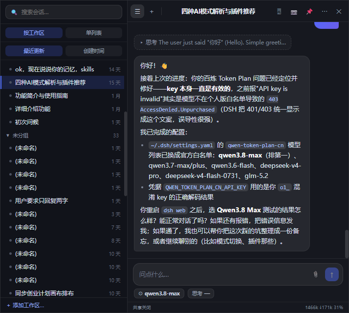
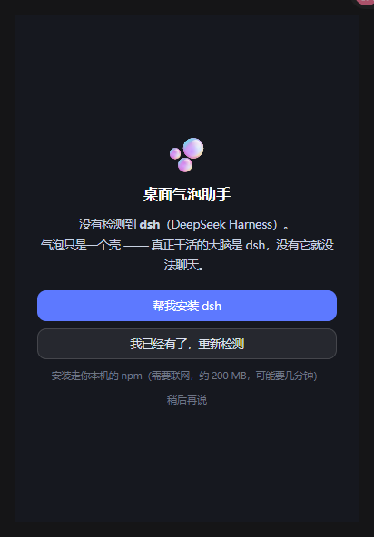
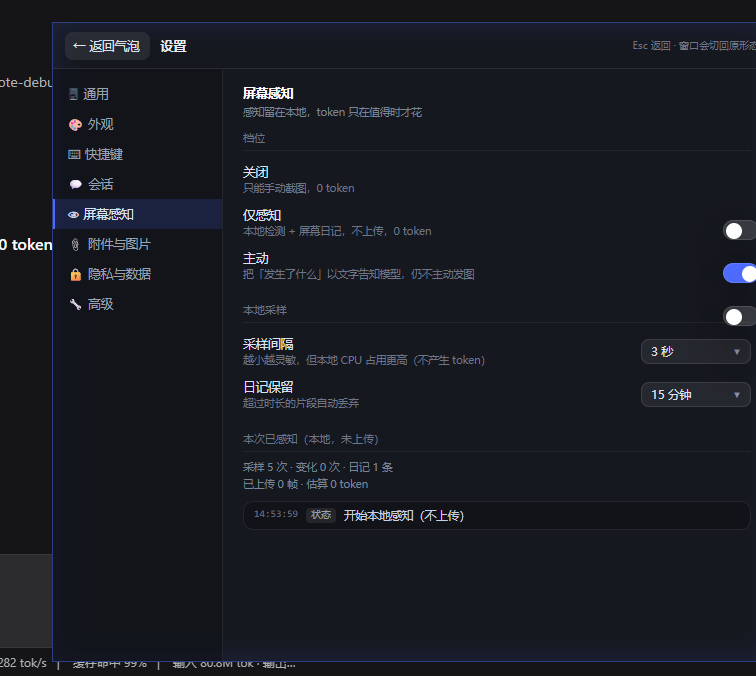

# desktop-bubble · 桌面气泡助手

> 把 dsh（DeepSeek Harness）的会话，装进一个常驻桌面的可缩放气泡窗口。

<h3 align="center">
  <a href="https://github.com/xuxian1992/desktop-bubble/releases/latest/download/desktop-bubble-1.0.0-win-x64.zip">⬇️ 下载 Windows 免安装版（133 MB）</a>
</h3>

<p align="center">
  解压后双击 <code>START.vbs</code>，不需要安装，删目录即卸载<br>
  <sub>也提供 <a href="https://github.com/xuxian1992/desktop-bubble/releases/latest/download/desktop-bubble-1.0.0-win-x64-setup.exe">安装包 exe（98 MB）</a> · <a href="https://github.com/xuxian1992/desktop-bubble/releases">全部版本</a></sub>
</p>



## 这是什么

终端里的一次会话，关掉窗口就结束了。**气泡不是。**

它常驻在你的桌面角落 —— 写代码的间隙瞥一眼，离开两小时回来接着说，随时能缩成一个胶囊。
你的内核没变（技能、工具、记忆、工作流一个字都照旧），变的是**你有了一个一直在那儿的入口**。

## 特性

| | |
|---|---|
| **三种形态** | 胶囊 96×96 · 气泡 380×560 · 面板 720×640，任意拖拽缩放 |
| **聊天** | Markdown 渲染 · 附件（文本内联 / 图片压缩 / 其它只发路径）· 模型与思考档切换 |
| **会话管理** | 按工作区分组 · 搜索 · 重命名 · 分叉 · 归档 |
| **屏幕感知** | 本地变化检测 + 屏幕日记，**默认不上传任何像素** |
| **截图提问** | 框选 / 整个屏幕 / 前台窗口 —— 三种范围按需选 |
| **全局热键** | 默认 `Ctrl+Alt+空格` 呼出，可改绑 |
| **MCP 工具** | 模型可调用 9 个 `bubble_*` 工具驱动气泡（换会话、调窗口、查日记…） |
| **一键接入** | 自动把 MCP 与状态块插件写进 dsh 的 profile 叠加层 |
| **首次运行向导** | 自动检测并帮你装 Node.js 与 dsh，还能填 API Key |

## 它是怎么工作的

```
┌─ 气泡（Electron）──────────────────────┐
│  渲染进程  React 界面                   │
│  主进程    连 dsh 的双 WebSocket、       │
│            本地控制接口、截图、热键      │
└───────────────┬───────────────────────┘
                │ POST /api/<method>      ← 一元调用
                │ /api/events.mux         ← 会话事件
                │ /api/events.host        ← 会话增删/状态
        ┌───────▼────────┐
        │  dsh web       │  ← 真正干活的大脑
        └────────────────┘
```

**气泡只是一个壳。** 所有推理、技能、记忆都在 dsh 里 —— 这也是为什么它不重复造轮子。

## 环境要求

- **Node.js 18+**（向导可以帮你装便携版）
- **dsh**（向导可以帮你装）
- **Windows 10 2004+ / 11**（截图不拍到自己依赖 Windows 的窗口显示亲和性）

## 从源码运行

```bash
npm install
npm run dev
```

首次启动会看到向导：检测环境 → 缺什么补什么 → 填 API Key → 一键接入。



## 打包安装包

```bash
npm run build      # 编译
npm run dist       # 出 NSIS 安装包 → release/
```

## 隐私与权限

**这是这个项目最在意的一件事。**

### 屏幕感知分两档，默认关闭

| 档位 | 行为 | token 成本 |
|---|---|---|
| **关闭**（默认） | 什么都不做，只能手动截图 | 0 |
| **仅感知** | 本地做变化检测、写屏幕日记 | **0** |

**「仅感知」档下，屏幕内容一个字节都不会离开你的机器。**
本地只算画面的哈希值来判断变没变，变化时才存一张 480px 的缩略图到内存里的环形缓冲（默认保留 15 分钟）。

### 截图不拍到自己

看窗口时走**窗口源捕获**（Windows 的 WGC 只拍该窗口自己的表面，覆盖层天然进不来）；
看整屏时用 **Windows 的 WDA** —— 窗口对**你**可见，对**抓屏 API** 不可见。

两种方式都**不影响你的使用**：气泡照常显示、照常能点。

### 发图是唯一真正的开销

所以设计上**绝不主动把画面推给模型**。模型想知道屏幕上有什么，得自己调工具 ——
而且它先读到的通常是「14:32 出现了一个标题含『错误』的窗口」这种文字，再决定要不要取像素。



## 已知限制

- **未签名**：个人开源项目，不做代码签名。Windows 可能提示「未知发布者」；若系统开启了**智能应用控制**，请用免安装版（它用的 `electron.exe` 是官方原版）或直接从源码运行
- **macOS 版**：electron-builder 只能在 macOS 上构建 mac 目标，本仓库提供了 CI 工作流（`.github/workflows/mac.yml`）
- 屏幕感知**不含 OCR** —— 它读不到屏幕上的文字，只给窗口标题与变化时间

## 许可

[MIT](LICENSE)